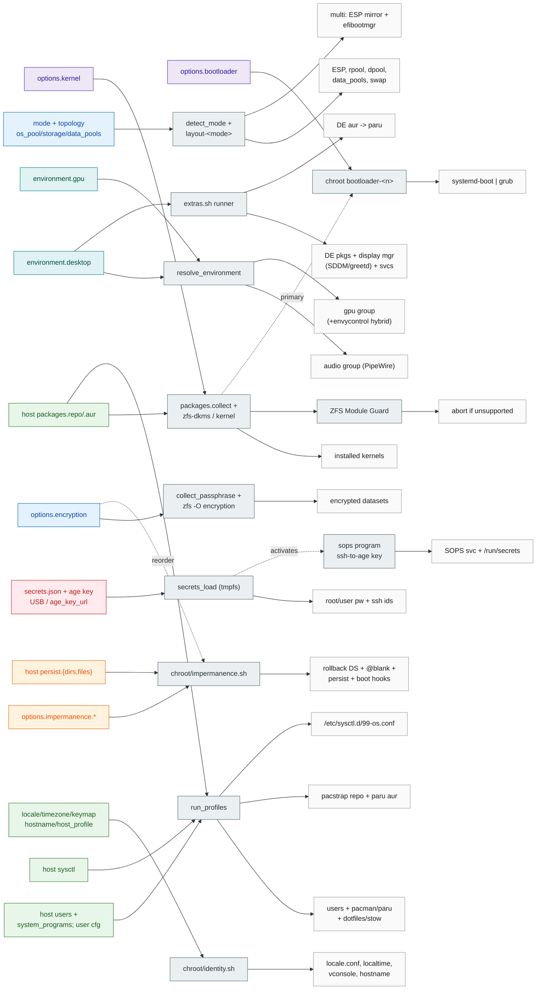
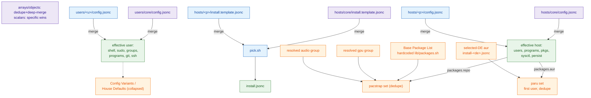
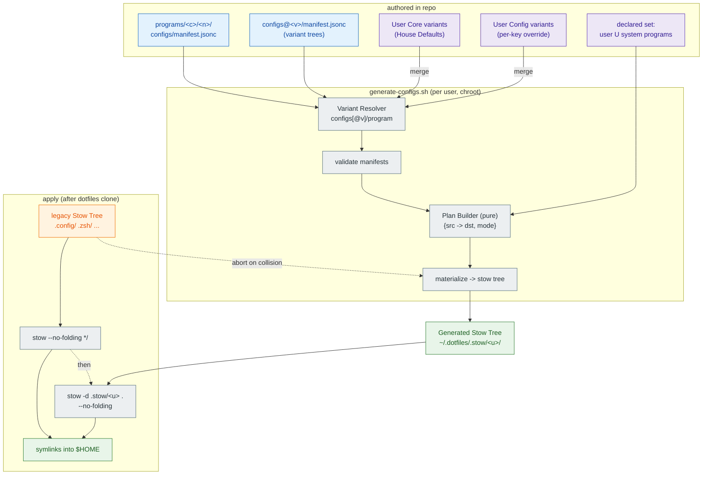

# Architecture & Config Map

Config-altitude view of the installer: the end-to-end flow, what each
config knob changes, and how the layered configs merge. Module-altitude
view (which `lib/` file calls what) lives in [README §1](README.md).
Term definitions: `../CONTEXT.md`. Decisions: `../docs/adr/`.

## Legend

- **Diagram 1** — full lifecycle flow. Diamonds = config-gated
  branches. Stages: PREP (existing machine) → LIVE-CD → INSTALL → POST.
- **Diagram 2** — config → phase/module → result. Left nodes colored by
  concern; middle = the module that consumes the key (same phase names
  as Diagram 1); right = on-disk/runtime result. Dashed = cross-cutting.
- **Diagram 3** — merge/layering. `core + specific → effective`, plus
  how the final pacstrap/paru package sets are composed.
- **Diagram 4** — per-user config-tree authoring & generation. The
  machinery collapsed in Diagram 3: how program config trees + variants
  become `$HOME` symlinks via the Config Generator + two stow passes.

Concern colors (Diagram 2 left column): storage = blue, boot+kernel =
purple, desktop+gpu = teal, impermanence = orange, identity/users/
packages/sysctl = green, secrets = red.

---

## Diagram 1 — Lifecycle flow

Everything you set up to reach an install, and the one required
post-install step. Secrets, encryption, impermanence, and disk mode are
the gates. Picker vs hand-author is the only authoring fork on the
live-CD (ADR 0010).

```mermaid
flowchart TD
  classDef cfg fill:#e3f2fd,stroke:#1565c0,color:#0d47a1
  classDef act fill:#f1f8e9,stroke:#558b2f,color:#33691e
  classDef dec fill:#fff8e1,stroke:#f9a825,color:#e65100
  classDef opt fill:#fce4ec,stroke:#ad1457,color:#880e4f

  subgraph PREP["PREP — existing machine"]
    direction TB
    P1["fetch-iso.sh<br/>archzfs-compatible ISO"]:::act
    P2["flash USB (dd)"]:::act
    Psec{"secrets?"}:::dec
    Pk["age-keygen + age -p<br/>USB or age_key_url"]:::opt
    Psy[".sops.yaml<br/>personal pubkey"]:::opt
    Pss["sops host + user<br/>secrets.json"]:::opt
    Pc["author + commit configs:<br/>host, user, opt template"]:::cfg
    P1-->P2-->Psec
    Psec-->|yes|Pk-->Psy-->Pss-->Pc
    Psec-->|no|Pc
  end

  subgraph LIVECD["LIVE-CD — boot target (UEFI)"]
    direction TB
    L0["boot ISO"]:::act
    Lp{"picker or hand?"}:::dec
    Lpk["tools/pick.sh<br/>host -> mode -> disks"]:::act
    Lh["vim install.jsonc"]:::cfg
    Lj["install.jsonc ready"]:::cfg
    L0-->Lp
    Lp-->|picker|Lpk-->Lj
    Lp-->|hand|Lh-->Lj
  end

  subgraph INSTALL["INSTALL — ./install.sh"]
    direction TB
    I1["01-bootstrap-zfs.sh"]:::act
    I2["02-wipe.sh (wipe all)"]:::act
    subgraph M["03-install.sh main()"]
      direction TB
      M1["load_config + detect_mode<br/>(single | multi)"]:::act
      M2["source layout + validate"]:::act
      M3{"plan + summary<br/>proceed?"}:::dec
      M4["collect_enc_passphrase<br/>if encryption"]:::opt
      M5["secrets_load -> tmpfs<br/>if secrets"]:::opt
      M6["partition + pools + esp"]:::act
      M7["install_base (pacstrap)"]:::act
      M8["zfs_verify (Module Guard)"]:::act
      M9["configure_system (chroot)"]:::act
      M10["run_profiles<br/>users + programs + DE"]:::act
      M11["apply_impermanence<br/>if impermanence"]:::opt
      M12["print machine age key<br/>if secrets"]:::opt
      M13["finalize: unmount + export"]:::act
      M1-->M2-->M3-->M4-->M5-->M6-->M7-->M8-->M9-->M10-->M11-->M12-->M13
    end
    I1-->I2-->M1
  end

  subgraph POST["POST — first boot"]
    direction TB
    O1["reboot"]:::act
    Os{"secrets?"}:::dec
    Ou["add machine key to .sops.yaml<br/>sops updatekeys + commit"]:::opt
    Od["done"]:::act
    O1-->Os
    Os-->|yes|Ou-->Od
    Os-->|no|Od
  end

  Pc-->L0
  Lj-->I1
  M13-->O1
```

> Planned (ADR 0029): a template may pin `mode`, skipping the mode
> prompt in the picker branch above (disks still picked).

---

## Diagram 2 — Config → phase → result

The "what does this knob change" map. Follow a left node rightward to
see its module and on-disk effect. Dashed edges are cross-cutting
couplings that are easy to forget.

Cross-cutting edges worth noting:
- `encryption` also reorders the impermanence rollback hook (decrypt
  before mount).
- primary `kernel` drives the bootloader default entry.
- `environment.desktop` pulls in audio (PipeWire), a display manager,
  and DE-specific AUR — not just DE packages.
- presence of any `secrets.json` *activates* the sops program; it is
  not declared in any host config (ADR 0025).

---

## Diagram 3 — Merge & package composition

Where each effective value comes from. Same merge rule everywhere
(arrays concat+dedupe, objects deep-merge, scalars: specific wins).
Secrets are never merged. Config variants / House Defaults collapsed
here — expanded in Diagram 4.

---

## Diagram 4 — Per-user config-tree authoring & generation

The machinery collapsed in Diagram 3 — how per-program user configs
become `$HOME` symlinks (ADR 0012). Authored as Program Config Trees
(default `configs/` + `configs@<variant>/` alternates). The Config
Generator (`tools/generate-configs.sh`, per user, in chroot between
dotfiles clone and stow) resolves a variant per program (House Defaults
from User Core, overridden per-key by User Config), validates manifests,
builds a plan, materializes the Generated Stow Tree. Two stow passes
apply it — legacy tree first, generated second. A planned dst already
owned by the legacy tree aborts generation.

---

## Cross-references

| Concept | Term (`../CONTEXT.md`) | ADR |
|---|---|---|
| Picker as separate tool | Pre-Install Picker | 0010 |
| Layout modes/validation | Layout Module | 0014, 0016 |
| Standalone data pools | Standalone Data Pool | 0027 |
| Stable device paths | — | 0028 |
| Env resolution | Environment Config / GPU | 0017 |
| DE owns its packages | Desktop Environment Adapter | 0021 |
| Kernel list + guard | Kernel Selection / Guard | 0024 |
| archzfs-compatible ISO | archzfs-Compatible ISO | 0023 |
| Impermanence | Impermanence (+ datasets) | 0008, 0009 |
| Secrets (SOPS/age) | Secrets Module | 0006 |
| sops activated by secrets | SOPS Runtime Service | 0025 |
| Host/user core layering | Host Core / User Core | 0004 |
| Packages as config fields | Host Package List / sysctl | 0007 |
| Profile vs hostname | Host Profile | 0020 |
| Per-program config tree | Program Config Tree / Variant | 0012 |
