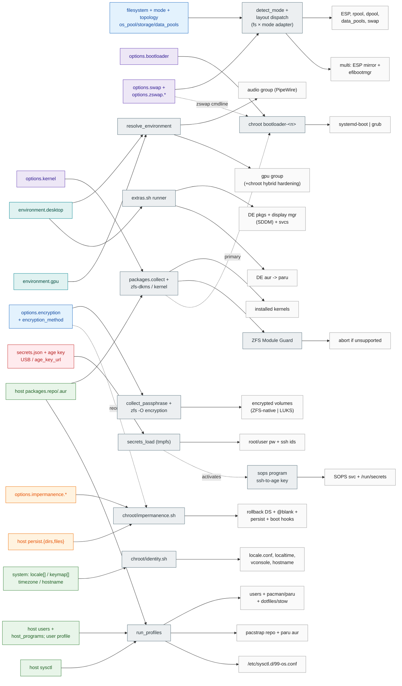
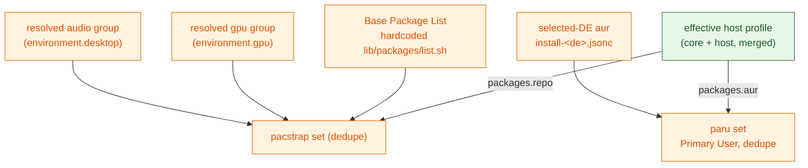
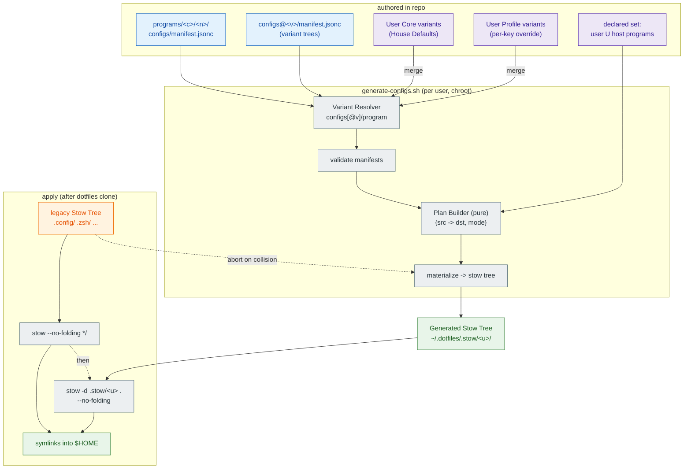

# Architecture & Config Map

Config-altitude view of the installer: the end-to-end flow, what each
config knob changes, and how the layered configs merge. Module-altitude
view (which `lib/` file calls what) lives in [README §1](README.md).
Term definitions: `../CONTEXT.md`. Decisions: `../docs/adr/`.

## Legend

- **Diagram 1** — full lifecycle flow. Diamonds = config-gated
  branches. Stages: PREP (existing machine) → LIVE-CD → INSTALL → POST.
- **Diagram 2** — config → phase/module → result. Left nodes colored by
  concern; middle = the module that consumes the key (same phase names
  as Diagram 1); right = on-disk/runtime result. Dashed = cross-cutting.
- **Diagram 3** — package composition. The merge rule is stated once in
  prose; the diagram shows which sources compose the pacstrap set vs the
  paru set.
- **Diagram 4** — per-user config-tree authoring & generation. The
  machinery collapsed in Diagram 3: how program config trees + variants
  become `$HOME` symlinks via the Config Generator + two stow passes.

Concern colors (Diagram 2 left column): storage = blue, boot+kernel =
purple, desktop+gpu = teal, impermanence = orange, identity/users/
packages/sysctl = green, secrets = red.

---

## Diagram 1 — Lifecycle flow

Everything you set up to reach an install, and the one required
post-install step. Secrets, encryption, impermanence, filesystem, and
disk mode are the gates. The live-CD fork has three front-ends over one
back-end (ADR 0036/0039): interactive `install.sh --profile` (the picker
resolves disks against a committed profile), the unattended `install.sh
<config-file>` seam (VM seed), and a bare `install.sh` **Guided
Installer** (an fzf TUI that authors the whole machine from scratch —
ADR 0039). All three assemble the same tmpfs effective config. The
top-level `filesystem` discriminator (default `zfs`; `btrfs`/`ext4`/`xfs`)
then selects the layout adapter (ADR 0040/0043).

```mermaid
flowchart TD
  classDef cfg fill:#e3f2fd,stroke:#1565c0,color:#0d47a1
  classDef act fill:#f1f8e9,stroke:#558b2f,color:#33691e
  classDef dec fill:#fff8e1,stroke:#f9a825,color:#e65100
  classDef opt fill:#fce4ec,stroke:#ad1457,color:#880e4f

  subgraph PREP["PREP — existing machine"]
    direction TB
    P1["fetch-iso.sh<br/>archzfs-compatible ISO"]:::act
    P2["flash USB (dd)"]:::act
    Psec{"secrets?"}:::dec
    Pk["age-keygen + age -p<br/>USB or age_key_url"]:::opt
    Psy[".sops.yaml<br/>personal pubkey"]:::opt
    Pss["sops host + user<br/>secrets.json"]:::opt
    Pc["author + commit profiles:<br/>hosts/&lt;n&gt; + users/&lt;n&gt;<br/>profile.jsonc"]:::cfg
    P1-->P2-->Psec
    Psec-->|yes|Pk-->Psy-->Pss-->Pc
    Psec-->|no|Pc
  end

  subgraph LIVECD["LIVE-CD — boot target (UEFI)"]
    direction TB
    L0["boot ISO"]:::act
    Lf{"which front-end?"}:::dec
    Lp["install.sh --profile &lt;name&gt;<br/>picker: pick disk(s) -><br/>assign to declared groups"]:::act
    Lg["install.sh (bare)<br/>Guided fzf TUI:<br/>author machine from scratch"]:::act
    Lu["install.sh &lt;config-file&gt;<br/>(pre-assembled, VM seed)"]:::cfg
    Le["effective config (tmpfs)"]:::cfg
    L0-->Lf
    Lf-->|"--profile"|Lp-->Le
    Lf-->|guided|Lg-->Le
    Lf-->|unattended|Lu-->Le
  end

  subgraph INSTALL["INSTALL — ./install.sh"]
    direction TB
    I1["01-bootstrap-zfs.sh<br/>(skip if no ZFS)"]:::act
    I2["02-wipe.sh<br/>(target disks only)"]:::act
    subgraph M["03-install.sh main()"]
      direction TB
      M1["load_config<br/>filesystem × mode"]:::act
      M2["source fs adapter<br/>+ validate"]:::act
      M3{"plan + summary<br/>proceed?"}:::dec
      M4["collect_enc_passphrase<br/>if encryption"]:::opt
      M5["secrets_load -> tmpfs<br/>if secrets"]:::opt
      M6["partition + volumes + esp"]:::act
      M7["install_base (pacstrap)"]:::act
      M8["zfs_verify (Module Guard)<br/>if any ZFS"]:::act
      M9["configure_system (chroot)"]:::act
      M10["run_profiles<br/>users + programs + DE"]:::act
      M11["apply_impermanence<br/>if impermanence"]:::opt
      M12["print machine age key<br/>if secrets"]:::opt
      M13["finalize: unmount + export"]:::act
      M1-->M2-->M3-->M4-->M5-->M6-->M7-->M8-->M9-->M10-->M11-->M12-->M13
    end
    I1-->I2-->M1
  end

  subgraph POST["POST — first boot"]
    direction TB
    O1["reboot"]:::act
    Os{"secrets?"}:::dec
    Ou["add machine key to .sops.yaml<br/>sops updatekeys + commit"]:::opt
    Od["done"]:::act
    O1-->Os
    Os-->|yes|Ou-->Od
    Os-->|no|Od
  end

  Pc-->L0
  Le-->I1
  M13-->O1
```

> The Host Profile declares `mode` (+ `os_pool` / `storage_groups[]` /
> `data_pools[]` with per-group `disk_count`); the picker only maps
> operator-picked disks onto those groups (ADR 0036/0037).

---

## Diagram 2 — Config → phase → result

The "what does this knob change" map. Follow a left node rightward to
see its module and on-disk effect. Dashed edges are cross-cutting
couplings that are easy to forget.

Cross-cutting edges worth noting:
- `filesystem` selects the layout adapter *and* the encryption seam
  (ZFS-native vs LUKS) *and* impermanence eligibility (ZFS/btrfs only);
  `zfs-dkms`, the Module Guard, and the archzfs ISO are gated on "any
  ZFS anywhere" (ADR 0040/0043).
- `encryption` also reorders the impermanence rollback hook (decrypt
  before mount).
- primary `kernel` drives the bootloader default entry.
- `swap` + `zswap` emit a kernel-cmdline fragment into both bootloader
  adapters (ADR 0045) — a zswap fragment is written only when both are on.
- `environment.desktop` pulls in audio (PipeWire), a display manager,
  and DE-specific AUR — not just DE packages.
- presence of any `secrets.json` *activates* the sops program; it is
  not declared in any host config (ADR 0025).

```mermaid
flowchart LR
  classDef cStore fill:#e3f2fd,stroke:#1565c0,color:#0d47a1
  classDef cBoot fill:#ede7f6,stroke:#5e35b1,color:#311b92
  classDef cDesk fill:#e0f2f1,stroke:#00838f,color:#004d40
  classDef cImp fill:#fff3e0,stroke:#ef6c00,color:#e65100
  classDef cProf fill:#e8f5e9,stroke:#2e7d32,color:#1b5e20
  classDef cSec fill:#ffebee,stroke:#c62828,color:#b71c1c
  classDef ph fill:#eceff1,stroke:#546e7a,color:#263238
  classDef rs fill:#fafafa,stroke:#9e9e9e,color:#212121

  d1["filesystem + mode + topology<br/>os_pool/storage/data_pools"]:::cStore
  d_enc["options.encryption<br/>+ encryption_method"]:::cStore
  d_k["options.kernel"]:::cBoot
  d_b["options.bootloader"]:::cBoot
  d_sw["options.swap +<br/>options.zswap.*"]:::cBoot
  d_de["environment.desktop"]:::cDesk
  d_g["environment.gpu"]:::cDesk
  d_im["options.impermanence.*"]:::cImp
  d_pe["host persist.{dirs,files}"]:::cImp
  d_id["system: locale[] / keymap[]<br/>timezone / hostname"]:::cProf
  d_up["host users +<br/>host_programs; user profile"]:::cProf
  d_pk["host packages.repo/.aur"]:::cProf
  d_sy["host sysctl"]:::cProf
  d_se["secrets.json + age key<br/>USB / age_key_url"]:::cSec

  ph_lay["detect_mode +<br/>layout dispatch<br/>(fs × mode adapter)"]:::ph
  ph_enc["collect_passphrase +<br/>zfs -O encryption"]:::ph
  ph_pk["packages.collect +<br/>zfs-dkms / kernel"]:::ph
  ph_g["ZFS Module Guard"]:::ph
  ph_b["chroot bootloader-&lt;n&gt;"]:::ph
  ph_ev["resolve_environment"]:::ph
  ph_ex["extras.sh runner"]:::ph
  ph_im["chroot/impermanence.sh"]:::ph
  ph_id["chroot/identity.sh"]:::ph
  ph_pr["run_profiles"]:::ph
  ph_se["secrets_load (tmpfs)"]:::ph
  ph_so["sops program<br/>ssh-to-age key"]:::ph

  r_pool["ESP, rpool, dpool,<br/>data_pools, swap"]:::rs
  r_mir["multi: ESP mirror +<br/>efibootmgr"]:::rs
  r_enc["encrypted volumes<br/>(ZFS-native | LUKS)"]:::rs
  r_k["installed kernels"]:::rs
  r_g["abort if unsupported"]:::rs
  r_b["systemd-boot | grub"]:::rs
  r_au["audio group (PipeWire)"]:::rs
  r_de["DE pkgs + display mgr<br/>(SDDM) + svcs"]:::rs
  r_da["DE aur -> paru"]:::rs
  r_gp["gpu group<br/>(+chroot hybrid hardening)"]:::rs
  r_im["rollback DS + @blank +<br/>persist + boot hooks"]:::rs
  r_id["locale.conf, localtime,<br/>vconsole, hostname"]:::rs
  r_up["users + pacman/paru<br/>+ dotfiles/stow"]:::rs
  r_pk["pacstrap repo + paru aur"]:::rs
  r_sy["/etc/sysctl.d/99-os.conf"]:::rs
  r_se["root/user pw + ssh ids"]:::rs
  r_so["SOPS svc + /run/secrets"]:::rs

  d1-->ph_lay
  d_sw-->ph_lay
  ph_lay-->r_pool
  ph_lay-->r_mir
  d_enc-->ph_enc-->r_enc
  d_enc-.reorder.->ph_im
  d_k-->ph_pk-->r_k
  ph_pk-->ph_g-->r_g
  ph_pk-.primary.->ph_b
  d_b-->ph_b-->r_b
  d_sw-.zswap cmdline.->ph_b
  d_de-->ph_ev-->r_au
  d_de-->ph_ex-->r_de
  ph_ex-->r_da
  d_g-->ph_ev-->r_gp
  d_im-->ph_im-->r_im
  d_pe-->ph_im
  d_id-->ph_id-->r_id
  d_up-->ph_pr-->r_up
  d_pk-->ph_pk
  d_pk-->ph_pr-->r_pk
  d_sy-->ph_pr-->r_sy
  d_se-->ph_se-->r_se
  ph_se-.activates.->ph_so-->r_so
```

---

## Diagram 3 — Package composition

**Merge model (one rule, everywhere):** host and user inputs are each
one `profile.jsonc` merged over its `core` — arrays concat+dedupe,
objects deep-merge, scalars specific-wins. The picker folds
operator-picked disks into the ephemeral effective config (no template,
no committed `install.jsonc` — ADR 0036); secrets are never merged;
config variants / House Defaults are expanded in Diagram 4.

The part worth a picture is what *lands* — which sources compose the
pacstrap set vs the paru set. `repo`/`gpu`/`audio` + the hardcoded Base
Package List are pacstrapped; `aur` + the selected DEs' AUR are installed
by the Primary User's single paru pass.

```mermaid
flowchart TD
  classDef eff fill:#e8f5e9,stroke:#2e7d32,color:#1b5e20
  classDef set fill:#fff3e0,stroke:#ef6c00,color:#e65100

  HE["effective host profile<br/>(core + host, merged)"]:::eff

  BASE["Base Package List<br/>hardcoded lib/packages/list.sh"]:::set
  GPU["resolved gpu group<br/>(environment.gpu)"]:::set
  AUD["resolved audio group<br/>(environment.desktop)"]:::set
  PAC["pacstrap set (dedupe)"]:::set
  HE-->|packages.repo|PAC
  BASE-->PAC
  GPU-->PAC
  AUD-->PAC

  DEAUR["selected-DE aur<br/>install-&lt;de&gt;.jsonc"]:::set
  PARU["paru set<br/>Primary User, dedupe"]:::set
  HE-->|packages.aur|PARU
  DEAUR-->PARU
```

---

## Diagram 4 — Per-user config-tree authoring & generation

The config-variant machinery Diagram 3 defers — how per-program user
configs become `$HOME` symlinks (ADR 0012). Authored as Program Config Trees
(default `configs/` + `configs@<variant>/` alternates). The Config
Generator (`tools/generate-configs.sh`, per user, in chroot between
dotfiles clone and stow) resolves a variant per program (House Defaults
from User Core, overridden per-key by the User Profile), validates manifests,
builds a plan, materializes the Generated Stow Tree. Two stow passes
apply it — legacy tree first, generated second. A planned dst already
owned by the legacy tree aborts generation.

```mermaid
flowchart TD
  classDef src fill:#e3f2fd,stroke:#1565c0,color:#0d47a1
  classDef sel fill:#ede7f6,stroke:#5e35b1,color:#311b92
  classDef proc fill:#eceff1,stroke:#546e7a,color:#263238
  classDef out fill:#e8f5e9,stroke:#2e7d32,color:#1b5e20
  classDef leg fill:#fff3e0,stroke:#ef6c00,color:#e65100

  subgraph AUTH["authored in repo"]
    T0["programs/&lt;c&gt;/&lt;n&gt;/<br/>configs/manifest.jsonc"]:::src
    TV["configs@&lt;v&gt;/manifest.jsonc<br/>(variant trees)"]:::src
    UCv["User Core variants<br/>(House Defaults)"]:::sel
    USv["User Profile variants<br/>(per-key override)"]:::sel
    DECL["declared set:<br/>user U host programs"]:::sel
  end

  subgraph GEN["generate-configs.sh (per user, chroot)"]
    VR["Variant Resolver<br/>configs[@v]/program"]:::proc
    VAL["validate manifests"]:::proc
    PB["Plan Builder (pure)<br/>{src -> dst, mode}"]:::proc
    MAT["materialize -> stow tree"]:::proc
  end

  GST["Generated Stow Tree<br/>~/.dotfiles/.stow/&lt;u&gt;/"]:::out

  subgraph APPLY["apply (after dotfiles clone)"]
    LEG["legacy Stow Tree<br/>.config/ .zsh/ ..."]:::leg
    S1["stow --no-folding */"]:::proc
    S2["stow -d .stow/&lt;u&gt; .<br/>--no-folding"]:::proc
    HOME["symlinks into $HOME"]:::out
  end

  UCv-->|merge|VR
  USv-->|merge|VR
  T0-->VR
  TV-->VR
  DECL-->PB
  VR-->VAL-->PB-->MAT-->GST
  LEG-->S1-->HOME
  GST-->S2-->HOME
  S1-.then.->S2
  LEG-.abort on collision.->MAT
```

---

## Cross-references

| Concept | Term (`../CONTEXT.md`) | ADR |
|---|---|---|
| Picker as install.sh front-end | Pre-Install Picker | 0036, 0010 |
| Guided Installer (fzf TUI front-end) | Guided Installer | 0039, 0041, 0042, 0047 |
| Unified profile + effective config | Host Profile / Effective Config | 0036 |
| Layout modes/validation | Layout Module | 0014, 0016 |
| Filesystem adapter axis (zfs/btrfs/ext4/xfs) | Filesystem Adapter | 0040, 0043 |
| Root vs data adapter split | Root Layout Adapter / Data Group Formatter | 0043 |
| btrfs impermanence (per-path rollback) | Impermanence | 0044 |
| Standalone data pools | Standalone Data Pool | 0027 |
| Per-group disk-count assignment | Storage Group / data_pools | 0037 |
| Stable device paths | — | 0028 |
| Env resolution | Environment Config / GPU | 0017 |
| DE owns its packages | Desktop Environment Adapter | 0021 |
| Kernel list + guard | Kernel Selection / Guard | 0024 |
| archzfs-compatible ISO | archzfs-Compatible ISO | 0023 |
| Impermanence | Impermanence (+ datasets) | 0008, 0009 |
| Secrets (SOPS/age) | Secrets Module | 0006 |
| sops activated by secrets | SOPS Runtime Service | 0025 |
| Host/user core layering | Host Core / User Core | 0004 |
| Packages as config fields | Host Package List / sysctl | 0007 |
| Profile vs hostname | Host Profile | 0020 |
| Per-program config tree | Program Config Tree / Variant | 0012 |
